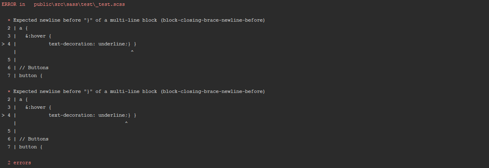

# stylelint-codeframe-formatter

[](http://badge.fury.io/js/stylelint-codeframe-formatter)
[](https://david-dm.org/bencergazda/stylelint-codeframe-formatter)
[](https://david-dm.org/bencergazda/stylelint-codeframe-formatter?type=dev)

[Stylelint](https://stylelint.io/) formatter using [babel-code-frame](https://www.npmjs.com/package/babel-code-frame) to show the piece of code where the errors and warnings are.




## Install

```console
$ npm install stylelint-codeframe-formatter --save-dev
```

## Usage

### [stylelint-webpack-plugin](https://github.com/JaKXz/stylelint-webpack-plugin/)

webpack.config.js

```
module.exports = {
    plugins: [
        new StylelintPlugin({
            formatter: require('stylelint-codeframe-formatter'),
            ...
        })
    ],
    ...
};
```

### [grunt-stylelint](https://github.com/wikimedia/grunt-stylelint/)

Gruntfile.js

```
module.exports = function(grunt) {
    grunt.initConfig({
        stylelint: {
            scss: {
                options: {
                    formatter: require('stylelint-codeframe-formatter')
                },
                ...
            }
        },
        ...
    });
};
```

### Stylelint CLI

Any ideas how to pass the module name to CLI?

## License

MIT © [Benedek Káldi](http://bencergazda.hu)<br/>
Heavily based on [Adrien Antoine](https://adriantoine.com)'s [eslint-codeframe-formatter](https://github.com/adriantoine/eslint-codeframe-formatter)